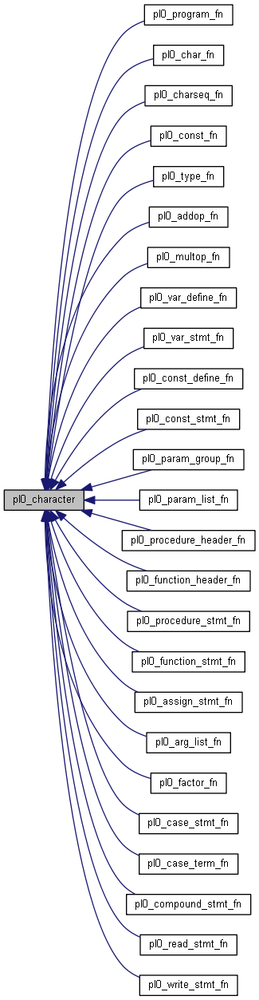

需求说明
-------

### 文法及其分析说明

难度：高级。文法描述如下：

~~~
<程序>         ::=  <分程序>.
<分程序>       ::=   [<常量说明部分>][<变量说明部分>]{[<过程说明部分>]| [<函数说明部分>]}<复合语句>
<常量说明部分>  ::=  const<常量定义>{,<常量定义>};
<常量定义>           ::=  <标识符>＝ <常量>
<常量>                   ::=  [+| -]<无符号整数>|<字符>
<字符>                   ::=  '<字母>' | '<数字>'
<字符串>               ::=   "{十进制编码为32,33,35-126的ASCII字符}"
<无符号整数>      ::=  <数字>{<数字>}
<标识符>               ::=  <字母>{<字母>|<数字>}
<变量说明部分>  ::=  var <变量说明> ; {<变量说明>;}
<变量说明>           ::=  <标识符>{, <标识符>} : <类型>
<类型>                 ::=   <基本类型>|array'['<无符号整数>']' of <基本类型>
<基本类型>      ::=   integer | char 
<过程说明部分>  ::=   <过程首部><分程序>{;<过程首部><分程序>};
<函数说明部分>  ::=   <函数首部><分程序>{;<函数首部><分程序>};
<过程首部>           ::=  procedure<标识符>[<形式参数表>];
<函数首部>           ::=  function <标识符>[<形式参数表>]: <基本类型>;
<形式参数表>       ::= '(' <形式参数段>{; <形式参数段>}')'
<形式参数段>       ::=  [var]<标识符>{, <标识符>}: <基本类型>
<语句>                    ::=  <赋值语句>|<条件语句>|<情况语句>|<过程调用语句>|<复合语句>|<读语句>|<写语句>|<for循环语句>|<空>
<赋值语句>           ::=  <标识符> := <表达式>| <函数标识符> := <表达式> | <标识符>'['<表达式>']':= <表达式>
<函数标识符>      ::=  <标识符>
<表达式>               ::=  [+|-]<项>{<加法运算符><项>}
<项>                        ::=  <因子>{<乘法运算符><因子>}
<因子>                   ::=  <标识符>|<无符号整数>|'('<表达式>')' | <函数调用语句>|<标识符>'['<表达式>']'
<函数调用语句>      ::=  <标识符>[<实在参数表>]
<实在参数表>      ::= '('<实在参数> {, <实在参数>}')'
<实在参数>          ::=  <表达式>
<加法运算符>      ::=  +|-
<乘法运算符>      ::=  *|/
<条件>                   ::=  <表达式><关系运算符><表达式>
<关系运算符>      ::=  <|<=|>|>= |=|<>
<条件语句>          ::=  if<条件>then<语句> | if<条件>then<语句>else<语句>
<情况语句>          ::=  case <表达式> of <情况表元素>{; <情况表元素>}end
<情况表元素>      ::=  <常量> : <语句>
<for循环语句>     ::=  for <标识符>  := <表达式> （downto | to） <表达式> do <语句>  //步长为1
<过程调用语句> ::=  <标识符>[<实在参数表>]
<复合语句>          ::=  begin<语句>{; <语句>}end
<读语句>               ::=   read'('<标识符>{,<标识符>}')'
<写语句>               ::=   write '(' <字符串>,<表达式> ')'|write'(' <字符串> ')'|write'('<表达式>')'
<字母>                   ::=   a|b|c|d…x|y|z |A|B…|Z
<数字>                   ::=   0|1|2|3…8|9
~~~

关于文法的理解、说明以及语义约束如下

1. 数据类型包括整数、字符、整数数组、字符数组。
2. 文法中的控制结构包括`for 循环语句`、`if-then-else 条件语句`、`case-of 分支结构`。参考 Pascal 的语义规范，对控制结构
做如下的语义约束：
    + `for` 循环语句步长只能为1或-1，循环变量只能为普通的变量(由`var`定义)，循环次数为起始值和终止值得差值，如果不满足循环
条件，循环不运行，循环变量不会被赋值。否则，循环结束后循环变量的值为终止值。每次循环中，循环变量的值在循环末尾改变。
    + `if-then-else`语句条件为真时执行`then`语句块，否则执行`else`语句块。
    + `case-of` 语句的情况语句只能为常量。具体实现时，转换为多条连续的`if-then-else`语句。

### 目标代码说明

目标代码：x86 汇编。

程序用到的所有的汇编指令如下

+ add
+ sub
+ imul
+ cdq
+ idiv
+ pop
+ push
+ call
+ leave
+ ret
+ jmp
+ jge
+ jg
+ jle
+ jl
+ jne
+ je

生成的汇编代码中用到了 x86 的寄存器：

+ eax, ecx, edx: 全局寄存器
+ esi, edi: 局部寄存器
+ ebx: 用于上层变量寻址、引用参数寻址。

为了实现输入输出的功能，目标代码中调用了`printf/scanf`做 IO 交互。引入标准 C 库函数的代码：

~~~nasm
;; external functions (from standard C library)
    extern _scanf
    extern _printf
    extern _getchar
~~~

目标代码 x86 汇编遵守 stdcall 调用约定，并为了适应 PL0 允许函数嵌套定义和调用，实现了 Display 区用于变量寻址。

### 优化方案说明

程序实现的优化包括 DAG 图和常量折叠与常量传播。

DAG 图用于实现公共字子表达式删除的优化，采用启发式策略导出四元式，测试结果
表明 DAG 的优化效果非常明显，优化后生成的汇编代码的长度仅仅为优化之前的 $\frac{3}{5}$ 左右。

在生成语法树的时候，就已经直接将常量带入到程序中，并保持其类型信息。同时，在 DAG 里，根据 DAG 的节点信息，再一次进行常量折叠
优化，将能够在编译器确定的值都直接带入表达式，优化效果同样十分显著。

详细设计
-------

### 程序结构

程序结构完整地包括了一个编译器的七个部分。具体实现中，采用 Parser Combinator 实现词法分析和语法分析，生成抽象语法
树(AST)，接下来，在抽象语法树做语义分析和检查，检查类型不匹配、函数参数不匹配、变量与函数和过程未定义等语义错误。
下一阶段是中间代码生成。再一次遍历抽象语法书，生成四元式作为中间表示，在生成过程中采用栈式符号表实现符号表管理的功能。
代码优化部分直接处理四元式序列，划分基本块，生成 DAG 并重新按照启发式算法导出四元式。最后，针对经过优化的四元式，逐条翻译，
配合基础器分配模块生成目标代码 x86 汇编。使用 nasm 汇编到目标文件，再使用 ld/link 链接，就可以得到可执行程序。

### 模块描述

程序包含以下几个模块：

+ 词法分析和语法分析
+ 语义分析
+ 中间代码生成
+ 代码优化
+ 目标代码生辰
+ 符号表管理

错误处理穿插在词法分析、语法分析和语义分析中进行。对于语法错误，出错即停止编译，对于语义错误，可以调过错误检查后面的代码，并
且由于实现了抽象语法树，能够实现非常准确的报错。

例如，文法中的“语句”成分对应的抽象语法树的结构示意图：

文中的各种“值”的抽象语法树的结构示意图：

“条件表达式”的抽象语法树的结构示意图：

### 调用依赖关系

函数的调用依赖关系分为以下几个部分：

+ 词法分析和语法分析

源程序中的所有元素被分为字符(符号等)和字符串(关键字等)两种。函数调用依赖图如下：

+ 四元式生成(TAC Generate)

程序的入口为 pl0_tac_program，于此相关的函数调用依赖图：

此外，与 TAC 的生成相关的代码另一部分为各种表达式的四元式生成，函数调用依赖图为：

+ 符号表管理

程序采用栈式符号表进行符号表管理，符号表管理贯穿中间代码生成和目标代码生成。对于 PL0 文法的特点，除了标识符是否已经定义，
标识符在整个程序中的嵌套深度也非常重要，这两个功能对应于`pl0_env::find`和`pl0_env::depth`函数，对应的函数调用关系图为：

### 符号表管理方案

符号表管理采用栈式符号表，符号表用`pl0_env`类来表示，这个类的函数如下所示：

~~~cpp
bool 	empty ()
bool 	find (std::string const &, bool)
bool 	find (std::string const &, bool, T &)
void 	push (T const &)
void 	pop ()
void 	tag ()
void 	detag ()
int 	depth ()
int 	depth (std::string const &)
void 	dump ()
~~~

在编译源程序时，没进入一个函数，都执行一次`tag`操作，表示一个层级标记，在退出一个函数时，都执行一次`detag`操作。通过这
两个操作在符号表栈上进行标记和取消标记，便可以非常精确地维护函数的作用域信息，便于进行精确地语义分析。程序一共维护四个
符号栈：常量标识符、变量标识符、函数标识符、过程标识符。每次读到一个新的标识符，都将其压入对应的栈，在离开该作用域时，通过
调用`detag`进行出栈操作。`depth`函数用于获取变量的嵌套层数，按照就近原则，从栈顶往前找，第一个找到的就是正在被使用的
标识符。

在生成汇编的时候，同样需要建立符号表以描述变量的层级信息，用于内层函数/过程寻址外层变量。在这一阶段，变量的深度信息非常重要，
必须准确地记录和获取一个变量的层级信息，才能够知道应该使用当前函数的 Display 区的哪一项进行间接寻址。对于 PL0 这类允许
作用域无限嵌套的语言，精确地维护符号表异常重要。

### 存储分配方案

目标代码为 x86 汇编，因此，目标代码的存储分配也遵守 x86 汇编的编程规范进行。程序中定义的常量都直接带入到四元式中，目标
代码中，不再为常量分配存储空间，这一考虑对最终得到的可执行程序的内存空间占用和执行性能都有很好的优化作用。所有的变量都在
栈上，在每个函数开始处，就为所有的程序中显式定义的变量分配存储空间。对于在编译生成四元式阶段产生的临时变量，在临时寄存器
不够用，需要溢出到栈上时才会分配存储空间。因为临时变量在大多数情况下其作用域都不会跨越基本块的界限，因此，在基本块的末尾，
也不用将寄存器中的临时变量写回到内存中，这一点对内存占用的优化非常明显。

对于函数调用，遵守 stdcall 调用约定，在调用`scanf/printf`时，将参数压入栈中，在函数返回后，再使用`pop`指令来平衡栈。每个
函数的栈包括参数、返回地址，prev ebp，Display 区，返回值，以及局部变量。这些项目在内存上的空间排布如下：

~~~
低地址

^
|----------------------------
|   local variable
|----------------------
|   return value (optional)
|----------------------
|
|   displays
|
|----------------------
|   prev ebp
|----------------------
|   return addr
|----------------------
|   arguments
|---------------------------

高地址 
~~~

### 四元式设计

程序中使用到的所有的四元式指令：

| 序号  | 格式                           | 说明            |
|:-----:|-------------------------------|-----------------| 
|1      | = target source               | 赋值            |
|2      | []= array index source        | 从数组中取元素    |
|3      | =[] target array index        | 对数组元素赋值    |
|5      | loadret                       | load返回值到eax  |
|6      | call func/proc {args} [return]| 函数/过程调用     |
|7      | read target                   | 读入             |
|8      | write_s string label          | 输出字符串        |
|9      | write_e value                 | 输出表达式        |
|10     | + c a b                       | 加法             |
|11     | - c a b                       | 减法             |
|12     | * c a b                       | 乘法             |
|13     | / c a b                       | 除法             |
|14     | % c a b                       | 取模运算          |
|15     | cmp a b                       | 比较大小          |
|16     | label label_no                | 定义label         |
|17     | goto label_no                 | 跳转             |
|18     | def                           | 定义变量          |

### 代码生成方案设计

从四元式生成汇编，我采用的逐条翻译的方法，直接将四元式转换为对应语义的 x86 汇编指令。这一部分的内容，比较重要的是寄存器分配器 Registers Manager。寄存器分配相关的函数调用逻辑如下图所示：

`load/store`函数用于执行将变量加载到寄存器与将变量写回到栈上的操作。`spill`用于在临时进存其不够用的时候将寄存器中的变量溢出到
栈上，`addr`函数用于寻址，如果是外部变量或者引用参数，寻址过程需要用到`ebx`寄存器。同时，寄存器管理器需要跟符号表部分的函数进行
交互，以确定变量的层级信息。

### 优化算法设计

程序包含的优化包括这几个部分：

+ 划分基本块

任何条件/无条件跳转语句都是基本块的边界，例如四元式中的指令`call`、`jmp`。每个基本块的第一条语句为一个label，用于唯一地标识
这个基本块，便于记录程序的控制流信息。

+ DAG 

DAG 用于删除公共子表达式，采用启发式算法导出代码。`read/write`指令也放入 DAG 中，通过建立数据之间的依赖关系来确保指令顺序
调整之后依然能够保证 IO 操作的顺序，从而严格保证程序语义的正确性。

+ 常量传播和常量折叠

在抽象语法树上，常量已经直接带入到表达式中，在 DAG 中，会再次进行更为激进的常量传播和常量折叠，以削弱运算强度。

### 出错处理方案

程序能够报出的错误包括语法错误和语义错误。总体来说，会有以下三类错误：

+ 源程序存在语法错误：

~~~
Errors occurred during parsing.
~~~

+ 源程序中，在 `begin...end.`之后仍然有多余字符：

~~~
Extra characters in source text.
~~~

+ 语义错误：

~~~
Errors occurred during semantic analysing.
~~~

语法错误无法精确报出程序出错的位置。语义错误能够非常精确地报出错误类型和出错位置，错误格式：

~~~
line:column: ERROR: error message.
~~~

语法错误的错误类型包括：

1. redefinition of "a"

表示标识符重复定义。

2. use of undeclared identifier "a"

表示使用了未定义的标识符。

3. use an array identifier "a" as a factor.

表示将数组名作为一个因子来使用。

4. expected an array identifier.

表示对一个非数组标识符取索引。

5. expected an non-array identifier.

表示对一个数组变量进行加减乘除运算。

6. expected an valid expression as the array index.

在通过下标取数组元素时，索引不是一个合法的表达式。

7. expected an valid expression as the condition expression.

在条件表达式中，用于判断条件的表达式不是一个合法的表达式。

8. duplicate identifier "F".

标识符重复定义，新定义的函数的名字与一个已经存在的变量名相同(when there is a variable with the same name of it's container function or procedure)。

9. overloaded identifier "F" isn't a function.

把一个变量当成函数/过程来调用(when there is a function or procedure with the same name of it's container function or procedure, or define a function or procedure when there already is a variable or constant with the same name)。

操作说明
-------

### 环境配置

程序使用 C++ 语言完成，对编译器/运行时环境的要求如下：

1. 编译器：MinGW 32bit 4.8.2 或者 Clang 64bit 3.7.0。这两个版本的环境已经进行过充分测试。
2. 汇编器：nasm 2.07. nasm 用于将生成的 x86 汇编文件汇编成目标文件(.o)。
3. 链接器：gcc/VC++ 6.0 link. 链接器用于将目标文件转换成可执行文件，由于输入输出用到了 `printf/scanf`，因此，需要链接
标准 C 库。

### 操作说明

1. 构建 pl0 编译器工程：

~~~shell
make dist
~~~

2. 编译源程序:

~~~shell
pl0c.out a.pas > a.asm
~~~

这一步可以得到 x86 汇编文件。

3. 汇编：

~~~shell
nasm -f win32 a.asm
~~~

这一步骤可以得到目标文件。

4. 链接：

~~~shell
gcc a.obj -o a.exe
~~~

或者：

~~~shell
link a.obj msvcrt.lib
~~~

就可以得到可执行文件 a.exe 了。

测试报告
-------

1. 测试 1 （正确）：

本程序重点测试函数和过程的递归调用，程序的功能是计算两个数之间的最大公约数(GCD)。如果执行执行，程序将输出：

    gcd-1 success.
    gcd-2 success.

程序源代码:

~~~pascal
var
    a, b: integer;

procedure swap(var a, b: integer);
var
    t: integer;
begin
    t := a; a := b; b := t;
end;

function mod(a, b: integer): integer;
begin
    mod := a-a/b*b;
end;

function gcd(a, b: integer): integer;
begin
    if a<b then
        swap(a, b)
    ;
    if b=0 then
        gcd := a
    else
        gcd := gcd(b, mod(a, b))
    ;
end;

begin
    if gcd(456, 8910) = 6 then
        write("gcd-1 success.")
    else
        write("gcd-1 failed.", gcd(456, 8910))
    ;
    if gcd(3456, 78910) = 2 then
        write("gcd-2 success.")
    else
        write("gcd-2 failed.", gcd(3456, 78910))
    ;
end.
~~~

2. 测试程序 2（正确）

程序的功能是测试各种空表达式是否能正确解析，程序如果运行正确，将会输出

    null statement success

程序源代码:

~~~pascal
var a, b, c: integer;

begin
    if a <> b then;
    if a <> b then else;
    begin
    end;
    for c := a to b do;
    write("null statement success")
end.
~~~

3. 测试程序 3（正确）

程序的功能是测试函数的递归调用和直接利用函数的返回值作为另一次函数调用的参数，主要考察点在于对程序中的`Value`的解析是否正确。
如果运行正确，程序将输出

    recursion success.

程序源代码：

~~~pascal
const a = 1;
var c: integer;

function f(b: integer): integer;
begin
	if b = a then begin
		f:= 1
	end
	else begin
		f := b + f(b - 1);
	end
end;
begin
	if f(f(f(3))) = 231 then 
		write("recursion success.")
	else
		write("recursion failed.", c);
end.
~~~

4. 测试程序 4（正确）

程序的功能是测试引用传参的正确性，以及将引用参数再次作为参数传给其他函数，以此判断寻址是否正确。如果程序运行成功，将会输出：

    reference argument 2 success.

程序源代码：

~~~pascal
var a : integer;

procedure p1(var c :integer);
begin
	c := c+1;
end;

procedure p2(var b :integer); 
begin
	b := b+1;
	p1(b);
end;

begin
	a := 0;
	p2(a);
	if a = 2 then
        write("reference argument 2 success.")
    else
        write("reference argument 2 failed.", a)
    ;
end.
~~~

5. 测试程序 5（正确）

程序的功能是测试乘除法，测试连续的乘除操作结果是否正确，因为在 x86 汇编中乘除法用到的寄存器比较多，因此乘除法操作时对寄存器的
操作的正确性非常关键。如果程序正确运行，输出结果为：

    fibonacci-1 10 success.
    fibonacci-1 10 success.

程序源代码：

~~~pascal
const a = 1, b = 2, c = 3, d = 4;
var x, y, z, i: integer;

function p1(var a: integer): integer;
begin
    for i := 1 to 10 do
        a := a * i;
    p1 := a;
end;

procedure p2(a: integer; var b: integer);
begin
    for i := 1 to 10 do begin
        a := a / i;
    end;
    b := a
end;

begin
    x := 1;
    p2(p1(x), y);
    if x = 3628800 then
        write("fibonacci-1 10 success.")
    else
        write("fibonacci-1 10 failed.", p1(x))
    ;
    if y = 1 then
        write("fibonacci-1 10 success.")
    else
        write("fibonacci-1 10 failed.", y)
    ;
end.
~~~

6. 测试程序 6（错误）

程序主要测试操作数组元素时，需要取下标运算，不能直接对数组名进行加减运算。因为有抽象语法树这一过程，因此，这类语义错误可以
非常准确地报错。程序输出的错误信息为：

    4:5 ERRRO: expected an non-array identifier "array1"
    7:26 ERRRO: use an array "array1" as a factor.

程序源代码：

~~~pascal
var i : integer; array1 : array[14] of integer;
begin
    array1[0] := 0;
    array1 := 1;
    for i := 2 to 13
        do
            array1[i] := array1+array1[i-2];
    if array1[13] = 233 then
        write("array operation right.")
    else
        write("array operation failed.");
end.
~~~

7. 测试程序 7（错误）

程序主要用来测试函数调用时的参数匹配问题，不能将常量用作引用传参，函数/过程调用时的参数类型必须匹配。错误信息如下：

    16:10 ERRRO: use constant or expression as reference value.
    16:12 ERRRO: use constant or expression as reference value.
    19:9 ERRRO: unmatched number of parameters and arguments.

程序源代码：

~~~pascal
var
    a, b, x, y: integer;

procedure swap(var a, b: integer);
var
    t: integer;
begin
    t := a;
    a := b;
    b := t;
end;

begin
    x := 133;
    y := 233;
    swap(1, 2);
    a := x;
    b := y;
    swap(a, b, a);
end.
~~~

8. 测试程序 8（错误）

这个测试程序主要用来测试使用未定义的标识符。程序中有多一个未定义就使用的地方，可以报出多个错误，并且准确定位错误。错误信息如下：

    3:5 ERRRO: use of undeclared identifier "t"
    5:10 ERRRO: use of undeclared identifier "t"
    9:5 ERRRO: use of undeclared identifier "x"
    10:5 ERRRO: use of undeclared identifier "y"
    11:5 ERRRO: use of undeclared identifier 'swap'
    11:9 ERRRO: unmatched number of parameters and arguments.
    12:10 ERRRO: use of undeclared identifier "x"
    12:5 ERRRO: use of undeclared identifier "a"
    13:10 ERRRO: use of undeclared identifier "y"
    13:5 ERRRO: use of undeclared identifier "b"
    14:10 ERRRO: use of undeclared identifier "a"
    14:13 ERRRO: use of undeclared identifier "b"
    14:16 ERRRO: use of undeclared identifier "a"
    14:5 ERRRO: use of undeclared identifier 'swap'
    14:9 ERRRO: unmatched number of parameters and arguments.

程序源代码：

~~~pascal
procedure swapswap(var a, b: integer);
begin
    t := a;
    a := b;
    b := t;
end;

begin
    x := 133;
    y := 233;
    swap(1, 2);
    a := x;
    b := y;
    swap(a, b, a);
end.
~~~

9. 测试程序 9（错误）

主要测试程序中有多余字符的情况，`begin...end`之后如果还有字符，将会产生这个错误，错误信息为：

    Extra characters in source text.

程序源代码：

~~~pascal
var x, y: integer;

begin
    x := 133;
    y := 233;
end.

extra chars.
~~~

10. 测试程序 10（错误）

主要测试在同一个作用域类，标识符重复定义的错误，错误信息参考了 FPC 编译器的错误信息，对于这段程序，将会输出的错误信息如下：

    2:7 ERRRO: duplicate identifier "f"
    3:5 ERRRO: duplicate identifier "f"
    4:14 ERRRO: overloaded identifier "f" isn't a function

程序源代码：

~~~pascal
function f: integer;
const f = 100;
var f: integer;
    procedure f;
    begin
    end;
begin
end;

begin
end.
~~~

总结感想
-------

总的来说，一学期的编译器实验课程让我受益匪浅，无论是知识上还是技术上还是心理上。

编译器技术是计算机科学中一颗十分耀眼的明星，程序设计语言理论也经过了很多年的蓬勃发展。形式语言和自动机理论的研究已经到了一个
不可逾越的高度，同时，很多理论上的成就在工程实践中也有着非常广泛的应用，在完成此次编译器课程实验的过程中，我对这一点的体会
非常深刻。从语法分析到代码优化到代码生成，都有完备的理论支撑。这一点对于学习和实践来说非常有好处。通过完成了一个简单的 pl0
编译器，我对程序运行的底层机制的理解也更加深刻，这些经验和思维方式将指导我写出更优的代码。

完成编译器需要的知识跨度非常大，这让我深刻地体会到标准化是一种远见。操作系统的内存布局机制、体系结构的特点、系统ABI、语言
本身的调用预定，CFFI 的设计与实现，等等，这些东西的背后是一本又一本厚厚的数据手册，正是这些成熟的约定，能够让我们的程序
拥有更强的可移植性，可以更加关注与我们要解决的问题本身。同时，已经在工程实践中广泛应用的方法一定要最可靠、最稳健的方法，
闭门造车，没有任何出路。这也启发我在学习实践中应该更加扩宽自己的视野，取其精华，弥补自身的不足。

程序编译和分析技术的工程量是非常大的。这对编译器的工程实践是一个很大的挑战，在这次编译实验中，我进一步理解了程序模块化与松
耦合的重要性。正是因为有良好的设计，因此，我能够在不破坏原来的代码的基础上添加新的功能，实现新的要求。

测试在软件开发中也非常重要，测试用例的积累和集成测试系统的构建可以明显加快开发的速度和稳定性。在这次编译实验中，我的自动化
测试脚本帮助我及时地发现错误，也基本确保了在解决问题的同时没有引入新的错误。

以上便是我的感想与收获。

